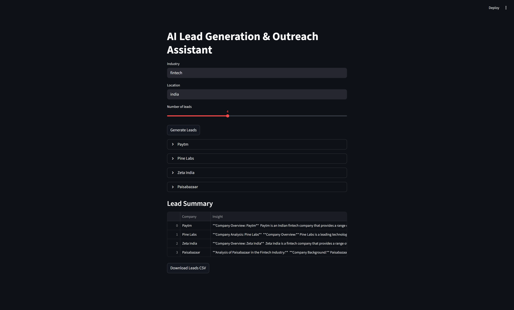

# AI Lead Generation & Outreach Assistant

An AI-powered tool that discovers companies in a target industry and generates business insights, automation ideas, and outreach strategies using Large Language Models.

## App Preview

## Features

- Discover companies based on industry and location
- Generate AI-powered business insights
- Suggest automation opportunities
- Create outreach emails
- Lead scoring for prioritization
- Export leads as CSV

## Tech Stack

- Python
- Streamlit
- Groq LLM API
- Pandas

## Demo

Run locally:

streamlit run app.py

## Example Use Case

Industry: FinTech  
Location: India

The tool generates companies like:

- Razorpay
- PhonePe
- Paytm

and suggests potential AI opportunities for each.

## Project Goal

This project demonstrates how AI can assist sales teams in identifying high-value leads and automating outreach strategies.

## Future Improvements

- LinkedIn lead discovery integration
- CRM export (HubSpot / Salesforce)
- AI-generated personalized outreach messages
- Lead scoring based on company growth signals
